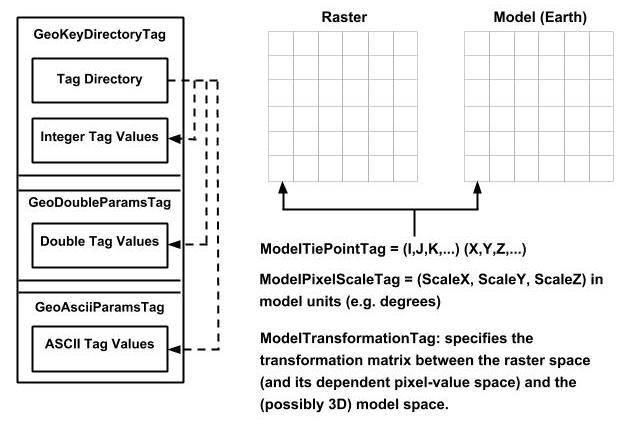

[appendix]
:appendix-caption: Annex
== GeoTIFF File Structure and GeoTIFF CRS and models principles (Informative)

=== The GeoTIFF File Structure

==== Introduction

The current GeoTIFF specification (Ritter and Ruth, 1995) includes a detailed description of the structural approach used in GeoTIFF and the semantics and values of the tags. The tag specifications are included in Clause 7 of this standard as requirements. This Annex provides an informative overview of the structure of a GeoTIFF file and tags. Much of this information is excerpted from Ritter and Ruth, 1995.

GeoTIFF fully complies with the TIFF 6.0 specifications, and its extensions do not in any way go against the TIFF recommendations, nor do they limit the scope of raster data supported by TIFF.

GeoTIFF uses a small set of reserved TIFF tags to store a broad range of georeferencing information, catering to geodetic as well as projected coordinate reference system needs. No information is stored in private structures, IFD's or other mechanisms that would hide information from naive TIFF reading software.

GeoTIFF uses a "MetaTag" (GeoKey) approach to encode dozens of information elements into just 6 tags, taking advantage of TIFF platform-independent data format representation to avoid cross-platform interchange difficulties. These keys are designed in a manner parallel to standard TIFF tags, and closely follow the TIFF discipline in their structure and layout. New keys may be defined as needs arise, within the current framework, and without requiring the allocation of new tags from Aldus/Adobe.

GeoTIFF uses numerical codes to describe coordinate reference systems, datums, ellipsoids, etc. The codes are derived from the EPSG list compiled by the
International Association of Oil and Gas Producers, and mechanisms for adding user-defined systems or their components have been established. The GeoTIFF information content is designed to be compatible with the data decomposition approach used by the National Spatial Data Infrastructure (NSDI) of the U.S. Federal Geographic Data Committee (FGDC).

While GeoTIFF provides a robust framework for specifying a broad class of existing coordinate reference systems, it is also fully extensible, permitting internal, private or proprietary information storage. However, since this standard arose from the need to avoid multiple proprietary encoding systems, use of private implementations is to be discouraged.

==== GeoTIFF Design Considerations

Every effort has been made to adhere to the philosophy of TIFF data abstraction. The GeoTIFF tags conform to a hierarchical data structure of tags and keys, similar to the tags which have been implemented in the "basic" and "extended" TIFF tags already supported in TIFF Version 6 specification. The following are some points considered in the design of GeoTIFF:

* Private binary structures, while permitted under the TIFF spec, are in general difficult to maintain, and are intrinsically platform- dependent. Whenever possible, information should be sorted into their intrinsic data-types, and placed into appropriately named tags. Also, implementers of TIFF readers would be more willing to honor a new tag specification if it does not require parsing novel binary structures.
* Any Tag value which is to be used as a "keyword" switch or modifier mistakes of mis-spelling a keyword, as well as facilitating an implementation in code using the "switch/case" features of most languages. In general, scanning ASCII strings for keywords (CaseINSensitiVE?) is a hazardous (not to mention slower and more complex) operation.
* True "Extensibility" strongly suggests that the Tags defined have a sufficiently abstract definition so that the same tag and its values may be used and interpreted in different ways as more complex information spaces are developed. For example, the old SubFileType tag (255) had to be obsoleted and replaced with a NewSubFileType tag, because images began appearing which could not fit into the narrowly defined classes for that Tag. Conversely, the YCbCrSubsampling Tag has taken on new meaning and importance as the JPEG compression standard for TIFF becomes finalized.

==== GeoTIFF Software Requirements

GeoTIFF requires support for all documented TIFF 6.0 tag data-types, and in particular requires the IEEE double-precision floating-point "DOUBLE" type tag. Most of the parameters for georeferencing will not have sufficient accuracy with single-precision IEEE, nor with RATIONAL format storage. The only other alternative for storing high-precision values would be to encode as ASCII, but this does not conform to TIFF recommendations for data encoding.

It is worth emphasizing here that the TIFF spec indicates that TIFF-compliant readers shall honor the 'byte-order' indicator, meaning that 4-byte integers from files created on opposite order machines will be swapped in software, and that 8-byte DOUBLE's will be 8-byte swapped.

A GeoTIFF reader/writer, in addition to supporting the standard TIFF tag types, must also have an additional module which can parse the "Geokey" MetaTag information. A public-domain software package for performing this function is available; (libgeotiff) see https://trac.osgeo.org/geotiff#libgeotiff.

==== GeoTIFF File and "Key" Structure

This section describes the abstract file-format and "GeoKey" data storage mechanism used in GeoTIFF. Uses of this mechanism for implementing georeferencing and geocoding is detailed in section 2.6 and section 2.7 of Ritter and Ruth, 1995.

A GeoTIFF file is a TIFF 6.0 file, and inherits the file structure as described in the corresponding portion of the TIFF spec. All GeoTIFF specific information is encoded in several additional reserved TIFF tags, and contains no private Image File Directories (IFD's), binary structures or other private information invisible to standard TIFF readers.

The number and type of parameters that would be required to describe most popular projection types would, if implemented as separate TIFF tags, likely require dozens or even hundred of tags, exhausting the limited resources of the TIFF tag-space. On the other hand, a private IFD, while providing thousands of free tags, is limited in that its tag-values are invisible to non-savvy TIFF readers (which don't know that the IFD_OFFSET tag value points to a private IFD).

To avoid these problems, a GeoTIFF file stores projection parameters in a set of "Keys" which are virtually identical in function to a "Tag", but has one more level of abstraction above TIFF. Effectively, it is a sort of "Meta-Tag". A Key works with formatted tag-values of a TIFF file the way that a TIFF file deals with the raw bytes of a data file. Like a tag, a Key has an ID number ranging from 0 to 65535, but unlike TIFF tags, all key ID's are available for use in GeoTIFF parameter definitions.

The Keys in GeoTIFF (also call "GeoKeys") are all referenced from the GeoKeyDirectoryTag, which defined as follows (Clause 7.1):

 GeoKeyDirectoryTag:
     Tag = 34735 (87AF.H)
     Type = SHORT (2-byte unsigned short)
     N = variable, >= 4
     Alias: ProjectionInfoTag, CoordSystemInfoTag

This tag may be used to store the GeoKey Directory, which defines and references the "GeoKeys", as described below.

The tag is an array of unsigned SHORT values, which are primarily grouped into blocks of 4. The first 4 values are special, and contain GeoKey directory header information. The header values consist of the following information, in order:

Header=\{KeyDirectoryVersion, KeyRevision, MinorRevision, NumberOfKeys} where

* _KeyDirectoryVersion_ indicates the current version of Key implementation, and will only change if this Tag's Key structure is changed. (Similar to the TIFFVersion (42)). The current DirectoryVersion number is 1. This value will most likely never change, and may be used to ensure that this is a valid Key-implementation.
* _KeyRevision_ indicates what revision of Key-Sets are used.
* _MinorRevision_ indicates what set of Key-codes are used. The complete revision number is denoted <KeyRevision>.<MinorRevision>
* _NumberOfKeys_ indicates how many Keys are defined by the rest of this Tag.

This header is immediately followed by a collection of <NumberOfKeys> KeyEntry sets, each of which is also 4-SHORTS long. Each KeyEntry is modeled on the "TIFFEntry" format of the TIFF directory header, and isof the form:

* KeyEntry = { KeyID, TIFFTagLocation, Count, Value_Offset } where

* _KeyID_ gives the key-ID value of the Key (identical in function to TIFF tag ID, but completely independent of TIFF tag-space),

* _TIFFTagLocation_ indicates which TIFF tag contains the value(s) of the Key: if TIFFTagLocation is 0, then the value is SHORT, and is contained in the "Value_Offset" entry. Otherwise, the type (format) of the value is implied by the TIFF-Type of the tag containing the value.

* _Count_ indicates the number of values in this key.

* _Value_Offset_ Value_Offset indicates the index-offset *into* the TagArray indicated by TIFFTagLocation, if it is nonzero. If TIFFTagLocation=0, then Value_Offset contains the actual (SHORT) value of the Key, and Count=1 is implied. *Note that the offset is not a byte-offset, but rather an index based on the natural data type of the specified tag array.*

Following the KeyEntry definitions, the KeyDirectory tag may also contain additional values. For example, if a Key requires multiple SHORT values, they shall be placed at the end of this tag, and the KeyEntry will set TIFFTagLocation=GeoKeyDirectoryTag, with the Value_Offset pointing to the location of the value(s).

All key-values which are not of type SHORT are to be stored in one of the following two tags, based on their format:

 GeoDoubleParamsTag:
     Tag = 34736 (87BO.H)
     Type = DOUBLE (IEEE Double precision)
     N = variable

This tag is used to store all of the DOUBLE valued GeoKeys, referenced by the GeoKeyDirectoryTag. The meaning of any value of this double array is determined from the GeoKeyDirectoryTag reference pointing to it. FLOAT values should first be converted to DOUBLE and stored here.

 GeoAsciiParamsTag:
     Tag = 34737 (87B1.H)
     Type = ASCII
     N = variable

This tag is used to store all of the ASCII valued GeoKeys, referenced by the GeoKeyDirectoryTag. Since keys use offsets into tags, any special comments may be placed at the beginning of this tag. For the most part, the only keys that are ASCII valued are "Citation" keys, giving documentation and references for obscure projections, datums, etc.

Note on ASCII Keys:

Special handling is required for ASCII-valued keys. While it is true that TIFF 6.0 permits multiple NULL-delimited strings within a single ASCII tag, the secondary strings might not appear in the output of naive "tiffdump" programs. For this reason, the null delimiter of each ASCII Key value shall be converted to a "|" (pipe) character before being installed back into the ASCII holding tag, so that a dump of the tag will look like this.

 AsciiTag="first_value|second_value|etc...last_value|"

A baseline GeoTIFF-reader must check for and convert the final "|" pipe character of a key back into a NULL before returning it to the client software.

_GeoKey Sort Order:_

In the TIFF spec it is required that TIFF tags be written out to the file in tag-ID sorted order. This is done to avoid forcing software to perform N-squared sort operations when reading and writing tags.

To follow the TIFF philosophy, GeoTIFF-writers shall store the GeoKey entries in key-sorted order within the GeoKeyDirectoryTag.

 Example:
   GeoKeyDirectoryTag=( 1, 1, 2, 6,
                     1024, 0, 1, 2,
                     1026, 34737,12, 0,
                     2048, 0, 1, 32767,
                     2049, 34737,14, 12,
                     2050, 0, 1, 6,
                     2051, 34736, 1, 0 )
   GeoDoubleParamsTag(34736)=(1.5)
   GeoAsciiParamsTag(34737)=("Custom File|My Geographic|")

The first line indicates that this is a Version 1 GeoTIFF GeoKey directory, the keys are Rev. 1.2, and there are 6 Keys defined in this tag.

The next line indicates that the first Key (ID=1024 = GTModelTypeGeoKey) has the value 2 (Geographic 2D), explicitly placed in the entry list (since TIFFTagLocation=0). The next line indicates that the Key 1026 (the GTCitationGeoKey) is listed in the GeoAsciiParamsTag (34737) array, starting at offset 0 (the first in array), and running for 12 bytes and so has the value "Custom File" (the "|" is converted to a null delimiter at the end). Going further down the list, the Key 2051 (GeogLinearUnitSizeGeoKey) is located in the GeoDoubleParamsTag (34736), at offset 0 and has the value 1.5; the value of key 2049 (GeogCitationGeoKey) is "My Geographic".

The TIFF layer handles all the problems of data structure, platform independence, format types, etc, by specifying byte-offsets, byte-order format and count, while the Key describes its key values at the TIFF level by specifying Tag number, array-index, and count. Since all TIFF information occurs in TIFF arrays of some sort, we have a robust method for storing anything in a Key that would occur in a Tag.

With this Key-value approach, there are 65536 Keys which have all the flexibility of TIFF tag, with the added advantage that a TIFF dump will provide all the information that exists in the GeoTIFF implementation.

This GeoKey mechanism is used extensively in Clause 7 where the parameters for defining Coordinate Systems and their underlying Coordinate Reference Systems (and projection if applicable) are defined.

=== GeoTIFF Models of the earth
==== Ellipsoid
The geoid - the earth stripped of all topography - forms a reference surface for the earth. However, because it is related to the earth's gravity field, the geoid is a very complex surface; indeed, at a detailed level its description is not well known. The geoid is therefore not used in practical mapping.

It has been found that an oblate ellipsoid (an ellipse rotated about its minor axis) is a good approximation to the shape of the geoid and therefore a good model of the earth. Many approximations exist: several hundred ellipsoids have been defined for scientific purposes and about 30 are in day-to-day use for Earth mapping. The size and shape of these bi-axial ellipsoids can be defined through two parameters. GeoTIFF requires one of these to be

the semi-major axis (a),

and the second to be either the inverse flattening (1/f) or the semi-minor axis (b).

Other ellipsoid parameters needed for cartographic applications, for example the eccentricity, can easily be calculated from the two defining parameters. Note that GeoTIFF uses the modern geodesy convention for the symbol (b) for the semi-minor axis. No provision is made for mapping other planets in which a tri-dimensional (tri-axial) ellipsoid might be required, where (b) would represent the semi-median axis and (c) the semi-minor axis.

Historical models exist which use a spherical approximation; such models are not recommended for modern applications, but if needed the size of a model sphere may be defined by specifying identical values for the semi-major and semi-minor axes; the inverse flattening cannot be used as it becomes infinite for perfect spheres.

Numeric codes for ellipsoids regularly used for earth mapping are included in the GeoTIFF reference lists.

==== Prime Meridian
The coordinate axes of the system referencing points on an ellipsoid are called latitude and longitude. More precisely, geodetic latitude and longitude are required in this GeoTIFF standard. A discussion of the several other types of latitude and longitude is beyond the scope of this document as they are not required for conventional georeferencing.

Geodetic latitude is defined to be the angle subtended with the ellipsoid's equatorial plane by a perpendicular through the surface of the ellipsoid from a point. Latitude is positive if north of the equator, negative if south.

Geodetic longitude is defined to be the angle measured about the minor (polar) axis of the ellipsoid from a prime meridian (see below) to the meridian through a point, positive if east of the prime meridian and negative if west. Unlike latitude, which has a natural origin at the equator, there is no feature on the ellipsoid which forms a natural origin for the measurement of longitude. The zero longitude can be any defined meridian. Historically, nations have used the meridian through their national astronomical observatories, giving rise to several prime meridians. By international convention, the meridian through Greenwich, England is the standard prime meridian. Longitude is only unambiguous if the longitude of its prime meridian relative to Greenwich is given. Prime meridians other than Greenwich that are sometimes used for earth mapping are included in the GeoTIFF reference lists.

====  Geodetic Datum (Geodetic Reference Frame)
As well as there being several ellipsoids in use to model the earth, any one particular ellipsoid can have its location and orientation relative to the earth defined in different ways. If the relationship between the ellipsoid and the earth is changed, then the coordinates of a point will change. Conversely, for coordinates to uniquely describe a location, the relationship between the earth and the ellipsoid must be defined. This relationship is described by a geodetic datum or geodetic reference frame. An exact geodetic definition of geodetic datums and reference frames is beyond the scope of GeoTIFF. However the GeoTIFF standard requires  that:

i) if geocentric/geographic/projected CRS is in the GeoTIFF CRS register:	cite the CRS code, through the GeodeticCRSGeoKey if geocentric or geographic, or if projected through the ProjectedCRSGeoKey. The geodetic datum is included in that register CRS definition.

ii) if the GeoTIFF CRS register contains the geodetic datum but not the geocentric/geographic/projected CRS: cite the CRS as user-defined (32767) through the GeodeticCRSGeoKey if geocentric or geographic, or through the ProjectedCRSGeoKey if projected, and then cite the geodetic datum code from the CRS register through the GeodeticDatumGeoKey.

iii) if geodetic datum is not in the GeoTIFF CRS register (so the GeoTIFF CRS register will not have any CRSs associated with the datum): cite the CRS as user-defined (32767) through the GeodeticCRSGeoKey if geocentric or geographic, or through the ProjectedCRSGeoKey if projected, and then cite the geodetic datum code as user-defined through the GeodeticDatumGeoKey. Requirement http://www.opengis.net/spec/GeoTIFF/0.0/GeodeticDatumGeoKey.user-defined then requires that the GeodeticCitationGeoKey, PrimeMeridianGeoKey and EllipsoidGeoKey be populated". The definition of the user-defined geodetic datum in addition to its ellipsoid and prime meridian should be described through the geodetic citation.

=== Coordinate Reference Systems in GeoTIFF
In the TIFF/GeoTIFF framework, there are essentially three different spaces in which coordinates may be defined. The spaces are:

. The raster space (Image space) R, used to reference the pixel values in an image,
. The Device space D, and
. The Model space, M, used to reference points on the earth.

In the sections that follow we shall discuss the relevance and use of each of these spaces, and their corresponding coordinate systems, from the standpoint of GeoTIFF.

==== Device Space and GeoTIFF
In standard TIFF 6.0 there are tags that relate raster space R with device space D, such as monitor, scanner or printer. The list of such tags consists of the following:

     ResolutionUnit (296)
     XResolution (282)
     YResolution (283)
     Orientation (274)
     XPosition (286)
     YPosition (287)

In GeoTIFF, provision is made to identify earth-referenced coordinate systems (model space M) and to relate M space with R space. This provision is independent of and can co-exist with the relationship between raster and device spaces. To emphasize the distinction, this spec shall not refer to "X" and "Y" raster coordinates, but rather to raster space "J" (row) and "I" (column) coordinate variables instead, as defined in section <<RasterSpace>>.

==== Raster Space
===== _Raster Data_

Raster data consists of spatially coherent, digitally stored numerical data, collected from sensors, scanners, or in other ways numerically derived. The manner in which this storage is implemented in a TIFF file is described in the standard TIFF specification (see <<clause_3_references.adoc#,TIFF Specification Revision 6.0>>).

Raster data values, as read in from a file, are organized by software into two-dimensional arrays, the indices of the arrays being used as coordinates. There may also be additional indices for multispectral data, but these indices do not refer to spatial coordinates but spectral, and so are not of concern here.

Many different types of raster data may be georeferenced, and there may be subtle ways in which the nature of the data itself influences how the coordinate system (Raster Space) is defined for raster data. For example, pixel data derived from imaging devices and sensors represent aggregate values collected over a small, finite, geographic area, and so it is natural to define coordinate systems in which the pixel value is thought of as filling an area. On the other hand, digital elevations models may consist of discrete "postings", which may best be considered as point measurements at the vertices of a grid, and not in the interior of a cell.

[#RasterSpace]
===== _Raster Space_

The choice of origin for raster space is not entirely arbitrary, and depends upon the nature of the data collected. Raster space coordinates shall be referred to by their pixel types, i.e., as "PixelIsArea" or "PixelIsPoint".

Note: For simplicity, both raster spaces documented below use a fixed pixel size and spacing of 1. Information regarding the visual representation of this data, such as pixels with non-unit aspect ratios, scales, orientations, etc., are best communicated with the TIFF 6.0 standard tags.

====== "PixelIsArea" Raster Space
The "PixelIsArea" raster grid space R, which is the default, uses coordinates I and J, with (0,0) denoting the upper-left corner of the image, and increasing I to the right, increasing J down. The first pixel-value fills the square grid cell with the bounds:

     top-left = (0,0), bottom-right = (1,1)

and so on; by extension this one-by-one grid cell is also referred to as a pixel. An N by M pixel image covers an area with the mathematically defined bounds (0,0), (N,M).

     (0,0)
      +---+---+-> I
      | * | * |
      +---+---+       Standard (PixelIsArea) TIFF Raster space R,
      | (1,1)   (2,1) showing the areas (*) of several pixels.
      |
      J

====== "PixelIsPoint" Raster Space

The PixelIsPoint raster grid space R uses the same coordinate axis names as used in PixelIsArea Raster space, with increasing I to the right, increasing J down. The first pixel-value however, is realized as a point value located at (0,0). An N by M pixel image consists of points which fill the mathematically defined bounds (0,0), (N-1,M-1).

     (0,0) (1,0)
      *-------*------> I
      |       |
      |       |      PixelIsPoint TIFF Raster space R,
      *-------*      showing the location (*) of several pixels.
      | (1,1)
      J

If a point-pixel image were to be displayed on a display device with pixel cells having the same size as the raster spacing, then the upper-left corner of the displayed image would be located in raster space at (-0.5, -0.5).

==== Model Coordinate Reference Systems (Model space)
'Real world' coordinate reference systems are imposed on models of the earth, hence the term _model coordinate reference system_ used in GeoTIFF. To georeference an image in GeoTIFF, you must specify a Raster Space coordinate system, choose a Model coordinate reference system, and specify a transformation between these two, as described in B.6.

To describe a location uniquely, a coordinate must be referenced to an adequately defined Model coordinate reference system. If the Model coordinate reference system is from the GeoTIFF standard definitions (<<Requirements for definition of Model CRS (when Model CRS is from GeoTIFF CRS register)>>), the only reference required is the standard coordinate reference system code. If the Model coordinate reference system is non-standard, it must be defined.

The following subtypes of Model coordinate  reference system (CRS) are recognized in GeoTIFF:

* Geographic
* Geocentric
* Projected ('map grid')
* Vertical

Projected ('map grid') and geographical 2D CRSs form two-dimensional horizontal coordinate systems (i.e. horizontal with respect to the earth's surface). Height is not part of these systems. To describe a position in three dimensions using these 2D systems it is necessary to consider height as a second one-dimensional vertical coordinate reference system in a 2D + 1D pseudo 3D compound CRS structure. Recommendations for describing compound CRSs are given in Annex D.

True spatial 3D CRS subtypes are geocentric and geographic 3D. See Annex D for recommendations for describing geographic 3D CRSs.

===== Geodetic Coordinate Reference Systems
A geodetic coordinate reference system is created by associating a coordinate system - a set of axes - with a geodetic datum. Subtypes of geodetic CRS supported by GeoTIFF are:

* geocentric, when the coordinate system is a 3-dimensional Cartesian coordinate system with its origin at or near the centre of the earth. The Z-axis is in or parallel to the earth's axis of rotation (or to the axis around which the rotational axis precesses). The X-axis is in the plane of the equator and passes through its intersection with the prime meridian, and the Y-axis is in the plane of the equator forming a right-handed coordinate system with the X and Z axes.
* geographic, when the coordinate system is ellipsoidal, i.e. latitude and longitude in the 2D case and in the 3D case additionally with ellipsoidal height. GeoTIFF v1.0 did not clearly define whether geographic CRSs are 2D or 3D.

Geocentric coordinates are readily converted to and from geographic 3D coordinates. Geographic 2D coordinates cannot be converted to geocentric coordinates without some assumption regarding height.

===== Projected Coordinate Reference Systems
Before digital computing capabilities were available, calculation on the surface of an ellipsoid was a non-trivial task. Reduction of the ellipsoid surface to a plane facilitated spatial calculations. A geographical coordinate reference system cannot be represented on a plane surface without distortion. Map projections are conversions of ellipsoidal coordinates (latitude and longitude) to Cartesian coordinates in a plane. A map projection consists of a coordinate operation method (through which the characteristics of the distortions are controlled) and a set of defining parameters specific to the method which are parameters in the method formulas, together with specified values for the set of coordinate operation parameters required by the projection method. A projected coordinate reference system results from the application of a map projection to a geographic coordinate reference system, associated with a planar coordinate system, in practice almost always Cartesian.

===== Vertical Coordinate Reference Systems
Many uses of GeoTIFF will be limited to a two-dimensional, horizontal, description of location for which geographic 2D coordinate reference systems and projected 2D coordinate reference systems are adequate. If a three-dimensional description of location is required, GeoTIFF allows this either through a geocentric coordinate reference system, or through the use of a geographic 3D coordinate reference system (where the vertical component is height above the ellipsoid), or by defining a 1D vertical coordinate reference system and using this together with a geographic 2D or projected coordinate reference system in an implicit compound CRS structure.
Vertical CRS are referenced to a vertical reference surface (vertical datum) at or close to the geoid, and associated with a 1D vertical coordinate system in which heights or depths are given.
Through increasing use of satellite navigation and positioning systems the ellipsoid is increasingly being used as a vertical reference surface. Heights above the ellipsoid are expressed as part of a geographic 3D CRS, but are not referenced to a vertical CRS (see Annex D). The ellipsoid surface may be offset vertically from the reference surface for a vertical CRS approximating the geoid by up to +/- 100m, and generally the two surfaces will not be exactly parallel to each other.

=== Defining Model Coordinate Reference Systems
Within the GeoTIFF standard a Model coordinate reference system (geocentric, geographic, projected or vertical) can be identified either by

     the code of a standard coordinate reference system

or by

     a user-defined system.

==== Standard Model Coordinate Reference Systems
In GeoTIFF, standard CRSs are identified through reference to an EPSG CRS code. This is sufficient to define the CRS component objects. Further information on EPSG codes is given in <<Requirements for definition of Model CRS (when Model CRS is from GeoTIFF CRS register)>>.

NOTE: This document removes the reference to the specific EPSG codes listed in the 1995 GeoTIFF v1.0 specification and replaces it by *allowing reference to any code in the EPSG Dataset*, including codes for any objects introduced into the EPSG Dataset after publication of this document.

==== User-defined Model Coordinate Reference Systems
GeoTIFF attempts to allow Model CRSs that are not described in the standard CRS register to be defined through user-defined keys. However the provisions made are limited in that:

* no provision was made for fully describing coordinate system. Although axis units could be described, provision for describing axis order and positive direction was omitted.

* there is ambiguity in the provision for describing user-defined map projections. Codes for some common map projection methods and map projection parameters were provided, but neither the method nor the parameter were defined. Inferences may be made from the listed map projection method names and map projection parameter names, but ambiguity remains so interoperability is not guaranteed.

In practice, user-defined Model CRS definition is limited to the following cases:

i)	a user-defined projected CRS which uses a base geographic CRS and a map projection that are both individually available from the GeoTIFF CRS register but, in the register, not associated together.
EPSG geogCRS code needs citing through Requirement http://www.opengis.net/spec/GeoTIFF/0.0/GeodeticCRSGeoKey.EPSG, EPSG projection code needs citing through Requirement http://www.opengis.net/spec/GeoTIFF/0.0/ProjectionGeoKey.EPSG

ii)	a user-defined projected CRS which uses a user-defined geographic CRS with a map projection that is available from the GeoTIFF CRS register.
GeogCRS needs defining as in Requirement http://www.opengis.net/spec/GeoTIFF/0.0/GeodeticCRSGeoKey.userdefined, EPSG projection code needs citing through Requirement http://www.opengis.net/spec/GeoTIFF/0.0/ProjectionGeoKey.EPSG

iii)	a user-defined geographic CRS available from the GeoTIFF CRS register and a map projection not in EPSG register. EPSG geogCRS code needs citing through Requirement http://www.opengis.net/spec/GeoTIFF/0.0/GeodeticCRSGeoKey.EPSG, projection needs defining through Requirement http://www.opengis.net/spec/GeoTIFF/0.0/ProjectionGeoKey.user_defined using the v1.0 provisions (use the names in annex C).

 iv) Neither base GeogCRS or map projection is in EPSG. GeogCRS needs defining, projection needs defining through Requirement http://www.opengis.net/spec/GeoTIFF/0.0/ProjectionGeoKey.user_defined using the v1.0 provisions (the names in annex C).

But even for these cases, unless stated through a Citation, some assumption is required about axis positive direction and axis order. Based on the standards available for US FGDC metadata and in the EPSG Dataset when the GeoTIFF v1.0 specification was written, it is assumed that:

*	projected CRS axes are easting, northing;
*	geographic 2D CRS axes are longitude east, latitude north;

NOTE: Users must note that this GeoTIFF practise is not in line with ISO TC211 and OGC rules for geographic 2D CRS axis order.

*	vertical CRS axis is height up;

and that values for the transformation from raster space to model space are consistent with these.

===== User-defined geographic 2D CRS
For a user-defined geographic 2D CRS the user is expected to provide:

*	geocentric coordinate reference system name (through the _GeodeticCitationGeoKey_),
*	geodetic datum through the _GeodeticDatumGeoKey_, either
**	the geodetic datum code (if available through standard EPSG code), or
**	user-defined geodetic datum name and other defining information:
***	the geodetic datum name (through the _GeodeticCitationGeoKey_),
***	the ellipsoid (through the _EllipsoidGeoKey_, see <<User-defined ellipsoid>>), and
***	the prime meridian (through the _PrimeMeridianGeoKey_, see <<User-defined prime meridian>>)
*	axis unit through the _GeogAngularUnitsGeoKey_, either
**	angle unit code (if available through standard EPSG code), or
**	user-defined angle unit name (through the _GeodeticCitationGeoKey_) and scaling from SI base unit of radian (through the _GeogAngularUnitSizeGeoKey_).
*	if the CRS uses a user-defined ellipsoid, the ellipsoid axis unit through the _GeogLinearUnitsGeoKey_, either
**	length unit code (if available through standard EPSG code), or
**	user-defined length unit name (through the _GeodeticCitationGeoKey_) and scaling from SI base unit of meter (through the _GeogLinearUnitSizeGeoKey_).

===== User-defined geocentric CRS
For a user-defined geocentric CRS the user is expected to provide:

*	geocentric coordinate reference system name (through the _GeodeticCitationGeoKey_),
*	geodetic datum through the _GeodeticDatumGeoKey_, either
**	the geodetic datum code (if available through standard EPSG code), or
**	user-defined geodetic datum name and other defining information:
***	the geodetic datum name (through the _GeodeticCitationGeoKey_),
***	the ellipsoid (through the _EllipsoidGeoKey_, see <<User-defined ellipsoid>>), and
***	the prime meridian (through the _PrimeMeridianGeoKey_, see <<User-defined prime meridian>>)
*	axis unit through the _GeogLinearUnitsGeoKey_, either
**	length unit code (if available through standard EPSG code), or
**	user-defined length unit name (through the _GeodeticCitationGeoKey_) and scaling from SI base unit of meter (through the _GeogLinearUnitSizeGeoKey_).
*	if the CRS uses a user-defined prime meridian, prime meridian Greenwich longitude unit through the _GeogAngularUnitsGeoKey_, either
**	angle unit code (if available through standard EPSG code), or
**	user-defined angle unit name (through the _GeodeticCitationGeoKey_) and scaling from SI base unit of radian (through the _GeogAngularUnitSizeGeoKey_).

===== User-defined ellipsoid
For any user-defined geocentric, geographic 3D or geographic 2D CRS an ellipsoid needs to be identified. The user is expected to provide:

*	ellipsoid through the _EllipsoidGeoKey_, either
**	the ellipsoid code (if available through standard EPSG code), or
**	the user-defined ellipsoid name and other defining information:
***	the ellipsoid name (through the _GeodeticCitationGeoKey_),
***	the ellipsoid semi-major axis (through the _EllipsoidSemiMajorAxisGeoKey_)
***	either the ellipsoid semi-minor axis (through the _EllipsoidSemiMinorAxisGeoKey_) or the ellipsoid inverse flattening (through the _EllipsoidInvFlatteningGeoKey_).
***	The units for the ellipsoid axis or axes:
*	For geocentric the ellipsoid axis or axes values must given in the length unit defined through the _GeogLinearUnitsGeoKey_ already required (see <<User-defined geocentric CRS>>).
*	For geographic 2D CRSs, then a _GeogLinearUnitsGeoKey_ is additionally required.

===== User-defined prime meridian
For any user-defined geocentric, geographic 3D or geographic 2D CRS a prime meridian needs to be identified whenever it is not Greenwich. (If no prime meridian is identified, it should be assumed to be Greenwich). The user is expected to provide:

*	Prime meridian through the _PrimeMeridianGeoKey_, either
**	the prime meridian code (if available through standard EPSG code), or
**	the user-defined prime meridian name and other defining information:
***	the prime meridian name (through the _GeodeticCitationGeoKey_),
***	the prime meridian longitude (through the _PrimeMeridianLongitudeGeoKey_),
***	the units for the prime meridian longitude:
*	For geographic CRSs the prime meridian longitude value must given in the angle unit defined through the _GeogAngularUnitsGeoKey_ already required (see <<User-defined geographic 2D CRS>>).
*	For geocentric CRSs, then a _GeogAngularUnitsGeoKey_ is additionally required.

===== User-defined Projected Coordinate Reference Systems
For a user-defined projected CRS the user is expected to provide:

*	projected coordinate reference system name (through _ProjectedCitationGeoKey_),
*	base geographic CRS (either standard EPSG code or user-defined, see <<User-defined geographic 2D CRS>>)
*	map projection through the _ProjectionGeoKey_, either
**	map projection code (if available through standard EPSG code), or
**	user-defined map projection (see below).
*	axis unit through _ProjLinearUnitsGeoKey_, either
**	length unit code (if available through standard EPSG code), or
**	user-defined length unit name (through the _ProjectedCitationGeoKey_) and scaling from SI base unit of meter (through the _ProjLinearUnitSizeGeoKey_).

===== User-defined map projection
For a user-defined map projection the user is expected to provide:

*	map projection name (through _ProjectedCitationGeoKey_),
*	map projection method (through _ProjMethodGeoKey_),
*	map projection parameter values (using a set of keys appropriate to the map projection method).
**	For map projection parameters that are lengths the parameter value needs to be expressed in the units defined through the _ProjLinearUnitsGeoKey_.
**	For map projection parameters that are angles the parameter value needs to be expressed in the units defined through the _GeogAngularUnitsGeoKey_, which is required in the base geographic CRS description, except for azimuths when the value needs to be expressed in the units defined through a _GeogAzimuthUnitsGeoKey_.
*	if the map projection method requires a parameter that is an azimuth, the azimuth unit through a _GeogAzimuthUnitsGeoKey_.

===== User-defined Vertical Coordinate Reference Systems
For a user-defined vertical CRS the user is expected to provide:

*vertical coordinate reference system name (through _VerticalCitationGeoKey_),
*	user-defined vertical datum through _VerticalDatumGeoKey_, either
**	the vertical datum code (if available through standard EPSG code), or
**	the vertical datum name and other defining information (through the _VerticalCitationGeoKey_)
*	vertical axis unit through _VerticalUnitsGeoKey_, either
**	linear unit code (if available through standard EPSG code), or
**	linear unit name (through _VerticalCitationGeoKey_) and scaling from SI base unit of meter (through _GeogLinearUnitSizeGeoKey_).

=== Coordinate Transformations

The purpose of GeoTIFF is to allow the definitive identification of georeferenced locations within a raster dataset. This is generally accomplished through tying raster space coordinates to a model space coordinate system, when no further information is required. In the GeoTIFF nomenclature, "georeferencing" refers to tying raster space to a model space M, while "geocoding" refers to defining how the model space M assigns coordinates to points on the earth.

The three tags defined below may be used for defining the relationship between R and M, and the relationship may be diagrammed as:

            ModelPixelScaleTag
             ModelTiepointTag
     R ------------ OR --------------> M
    (I,J,K) ModelTransformationTag (X,Y,Z)

The next section describes these Baseline georeferencing tags in detail.

=== Model CRS Reference Parameters
Most of the GeoTIFF standard definitions for model ('real world') coordinate reference systems and their component elements are based on the hierarchical system developed for the EPSG Geodetic Parameter Dataset ('EPSG Dataset'). The complete set of EPSG definitions is available at http://www.epsg-registry.org.

The EPSG Dataset is maintained by the Geodesy Subcommittee of the International Association of Oil and Gas Producers (IOGP). It follows the ISO 19111 / OGC Abstract Specification Topic 2 data model for describing the definitions of coordinate reference systems (CRSs). CRSs and coordinate operations are composed of a number of objects and attributes. Some of these objects themselves are composed objects and attributes, in a nested structure.
Each release of new or revised data is indicated by the EPSG Dataset version number. Since 1999 (from EPSG Dataset v5.0 and later) EPSG policy has been to never remove any invalid data but instead to leave it in the Dataset with its status set to deprecated. Deprecated data contains a significant error (significant defined as having impact on the result of applying a transformation or conversion) and is invalid. As such, since 1999 reference to the version of the EPSG Dataset to qualify codes of entities within the Dataset has been unnecessary. Using EPSG Dataset versions 5.0 and 9.3 as examples, crs:EPSG:5.0:4326 and crs:EPSG:9.3:4326 and crs:EPSG::4326 reference the same object.
The terms of use of the EPSG Dataset are given at http://www.epsg.org/Termsofuse.aspx.

==== EPSG coding of objects
Within the EPSG Dataset each object has a code. There have been three generations of coding:

i)	In v1.x of the publicly-available EPSG Dataset (1994-1996, published by the Petrotechnical Open Software Corporation, POSC), codes were alphanumeric. The initial letter indicated the object type, and objects within each type were then assigned sequential numbers.
ii)	With the introduction of GeoTIFF v1.0, EPSG Dataset v2.1 object codes were changed to integer values in the range 1024 through 32766. This overall code range was divided into non-overlapping sub-ranges, with one sub-range range for each object type. At that time, all EPSG object codes were unique. The GeoTIFF v1.0 specification was written at this time, and the EPSG code ranges for object types were written into the GeoTIFF v1.0 specification.
iii)	However as the number of items in the EPSG Dataset grew, some of the object code sub-ranges became fully assigned. The unique code system broke down. Since 2006, all object types have been separately assigned codes within the range 1024 through 32766. Within each object type codes remain unique, but one code value may be used for several object types. For example, code 4326 is used for both a CRS and for a geographic extent (in EPSG called 'area'). Codes at and just above the lower end of the range 1024 through 32766 may be used by numerous object types: for example by the year 2018 code 1026 has been assigned to 10 different object types. EPSG codes therefore are only unique when the object type is disclosed. EPSG::4326 is ambiguous, crs:EPSG::4326 and area:EPSG::4326 are unambiguous.

The GeoTIFF v1.0 specification refers to "obsolete EPSG/POSC codes". These refer to the numeric part of the alphanumeric coding in (i) above. These values had been used in some GeoTIFF v0.x files and for backward compatibility with those earlier files GeoTIFF v1.0 retained references to them. As all of these alphanumeric codes were changed to the integer coding in (ii) above, reference to these obsolete codes should now be unnecessary. In effect, for model CRS GeoKeys the obsolete code range may be treated as a reserved code range. Note: 'EPSG/POSC obsolete codes' refers specifically to the coding in generation (i) above, and should not be confused with codes from generations (ii) and (iii) which have been given the status of 'deprecated'.

A reference to an EPSG coordinate reference system code is sufficient for a complete definition: it implies use of the CRS components (datum, ellipsoid, map projection, etc.) that are associated with that CRS in the EPSG Dataset definition. The EPSG codes for coordinate reference system components should only be referenced when describing a user-defined coordinate reference system.

=== GeoTIFF Tags for Coordinate Transformations

For most common applications, the transformation between raster and model space may be defined with a set of raster-to-model tiepoints and scaling parameters. The following two tags may be used for this purpose:

    ModelTiepointTag:
          Tag = 33922 (8482.H)
          Type = DOUBLE (IEEE Double precision)
          N = 6*K, K = number of tiepoints
          Alias: GeoreferenceTag

This tag stores raster->model tiepoint pairs in the order

     ModelTiepointTag = (...,I,J,K, X,Y,Z...),

where (I,J,K) is the point at location (I,J) in raster space with pixel-value K, and (X,Y,Z) is a vector in model space. In most cases the model space is only two-dimensional, in which case both K and Z should be set to zero; this third dimension is provided in anticipation of support for 3D digital elevation models and vertical coordinate systems.

A raster image may be georeferenced simply by specifying its location, size and orientation in the model coordinate space M. This may be done by specifying the location of three of the four bounding corner points. However, tiepoints are only to be considered exact at the points specified; thus defining such a set of bounding tiepoints does *not* imply that the model space locations of the interior of the image may be exactly computed by a linear interpolation of these tiepoints.

However, since the relationship between the Raster space and the model space will often be an exact, affine transformation, this relationship can be defined using one set of tiepoints and the "ModelPixelScaleTag", described below, which gives the vertical and horizontal raster grid cell size, specified in model units.

If possible, the first tiepoint placed in this tag shall be the one establishing the location of the point (0,0) in raster space. However, if this is not possible (for example, if (0,0) is goes to a part of model space in which the projection is ill-defined), then there is no particular order in which the tiepoints need be listed.

For orthorectification or mosaicking applications a large number of tiepoints may be specified on a mesh over the raster image. However, the definition of associated grid interpolation methods is not in the scope of the current GeoTIFF spec.

Remark: As mentioned in section 2.5.1, all GeoTIFF information is independent of the XPosition, YPosition, and Orientation tags of the standard TIFF 6.0 spec.

The next two tags are optional tags provided for defining exact affine transformations between raster and model space; baseline GeoTIFF files may use either, but shall never use both within the same TIFF image directory.

     ModelPixelScaleTag:
          Tag = 33550
          Type = DOUBLE (IEEE Double precision)
          N = 3

This tag may be used to specify the size of raster pixel spacing in the model space units, when the raster space can be embedded in the model space coordinate system without rotation, and consists of the following 3 values:

     ModelPixelScaleTag = (ScaleX, ScaleY, ScaleZ)

where ScaleX and ScaleY give the horizontal and vertical spacing of raster pixels. The ScaleZ is primarily used to map the pixel value of a digital elevation model into the correct Z-scale, and so for most other purposes this value should be zero (since most model spaces are 2-D, with Z=0).

A single tiepoint in the ModelTiepointTag, together with this tag, completely determine the relationship between raster and model space; thus they comprise the two tags which Baseline GeoTIFF files most often will use to place a raster image into a "standard position" in model space.

Like the Tiepoint tag, this tag information is independent of the XPosition, YPosition, Resolution and Orientation tags of the standard TIFF 6.0 spec. However, simple reversals of orientation between raster and model space (e.g. horizontal or vertical flips) may be indicated by reversal of sign in the corresponding component of the ModelPixelScaleTag. GeoTIFF compliant readers must honor this sign-reversal convention.

This tag must not be used if the raster image requires rotation or shearing to place it into the standard model space. In such cases the transformation shall be defined with the more general ModelTransformationTag, defined below.

     ModelTransformationTag
          Tag = 34264 (85D8.H)
          Type = DOUBLE
          N = 16

This tag may be used to specify the transformation matrix between the raster space (and its dependent pixel-value space) and the (possibly 3D) model space. If specified, the tag shall have the following organization:

     ModelTransformationTag = (a,b,c,d,e....m,n,o,p).

where

     model                  image
     coords =     matrix  * coords
     |- -|     |-       -|  |- -|
     | X |     | a b c d |  | I |
     | | |     |         |  |   |
     | Y |     | e f g h |  | J |
     |   |  =  |         |  |   |
     | Z |     | i j k l |  | K |
     | | |     |         |  |   |
     | 1 |     | m n o p |  | 1 |
     |- -|     |-       -|  |- -|

By convention, and without loss of generality, the following parameters are currently hard-coded and will always be the same (but must be specified nonetheless):

     m = n = o = 0, p = 1.

For Baseline GeoTIFF, the model space is always 2-D, and so the matrix will have the more limited form:

     |- -|   |-       -| |- -|
     | X |   | a b 0 d | | I |
     | | |   |         | |   |
     | Y |   | e f 0 h | | J |
     |   | = |         | |   |
     | Z |   | 0 0 0 0 | | K |
     | | |   |         | |   |
     | 1 |   | 0 0 0 1 | | 1 |
     |- -|   |-       -| |- -|

Values "d" and "h" will often be used to represent translations in X and Y, and so will not necessarily be zero. All 16 values should be specified, in all cases. Only the raster-to-model transformation is defined; if the inverse transformation is required it must be computed by the client, to the desired accuracy.

This matrix tag should not be used if the ModelTiepointTag and the ModelPixelScaleTag are already defined. If only a single tiepoint (I,J,K,X,Y,Z) is specified, and the ModelPixelScale = (Sx, Sy, Sz) is specified, then the corresponding transformation matrix may be computed from them as:

     |-               -|
     | Sx  0.0 0.0 Tx  |    Tx = X - I/Sx
     | 0.0 -Sy 0.0 Ty  |    Ty = Y + J/Sy
     | 0.0 0.0 Sz  Tz  |    Tz = Z - K/Sz (if not 0)
     | 0.0 0.0 0.0 1.0 |
     |-               -|

where the -Sy is due the reversal of direction from J increasing- down in raster space to Y increasing-up in model space.

Like the Tiepoint tag, this tag information is independent of the XPosition, YPosition, and Orientation tags of the standard TIFF 6.0 spec.

=== Cookbook for Defining Transformations

Here is a 4-step guide to producing a set of Baseline GeoTIFF tags for defining coordinate transformation information of a raster dataset.

  Step 1: Establish the Raster Space coordinate system used: RasterPixelIsArea or RasterPixelIsPoint.

  Step 2: Establish/define the model space Type in which the image is to be georeferenced. Usually this will be a projected coordinate Reference system. If you are geocoding this data set, then the model space is defined to be the corresponding geographic, geocentric or projected coordinate reference system.

  Step 3: Identify the nature of the transformations needed to tie the raster data down to the model space coordinate reference system:

      Case 1: The model-location of a raster point (x,y) is known, but not the scale or orientations: Use the ModelTiepointTag to define the (X,Y,Z) coordinates of the known raster point.

      Case 2: The location of three non-collinear raster points are known exactly, but the linearity of the transformation is not known.

      Use the ModelTiepointTag to define the (X,Y,Z) coordinates of all three known raster points. Do not compute or define the ModelPixelScale or ModelTransformation tag.

      Case 3: The position and scale of the data is known exactly, and no rotation or shearing is needed to fit into the model space.

      Use the ModelTiepointTag to define the (X,Y,Z) coordinates of the known raster point, and the ModelPixelScaleTag to specify the scale.

      Case 4: The raster data requires rotation and/or lateral shearing to fit into the defined model space:

      Use the ModelTransformation matrix to define the transformation.

      Case 5: The raster data cannot be fit into the model space with a simple affine transformation (rubber-sheeting required). Use only the ModelTiepoint tag, and specify as many tiepoints as your application requires. Note, however, that this is not a Baseline GeoTIFF implementation, and should not be used for interchange; it is recommended that the image be geometrically rectified first, and put into a standard projected coordinate reference system.

  Step 4: Install the defined tag values in the TIFF file and close it.

=== Geocoding Raster Data
A geocoded image is a georeferenced image as described in section <<Coordinate Transformations>>, which also specifies a model space coordinate reference system (CRS) between the model space M (to which the raster space has been tied) and the earth. The relationship can be diagrammed, including the associated TIFF tags, as follows:

         ModelPixelScaleTag
         ModelTiepointTag              GeoKeyDirectoryTag CRS
     R -------- OR ---------------> M --------- AND -----------> Earth
         ModelTransformationTag        GeoDoubleParamsTag
                                       GeoAsciiParamsTag

The geocoding coordinate system is defined by the GeoKeyDirectoryTag, while the Georeferencing information (T) is defined by the ModelTiepointTag and the ModelPixelScale, or ModelTransformationTag. Since these two systems are independent of each other, the tags used to store the parameters are separated from each other in the GeoTIFF file to emphasize the orthogonality.
